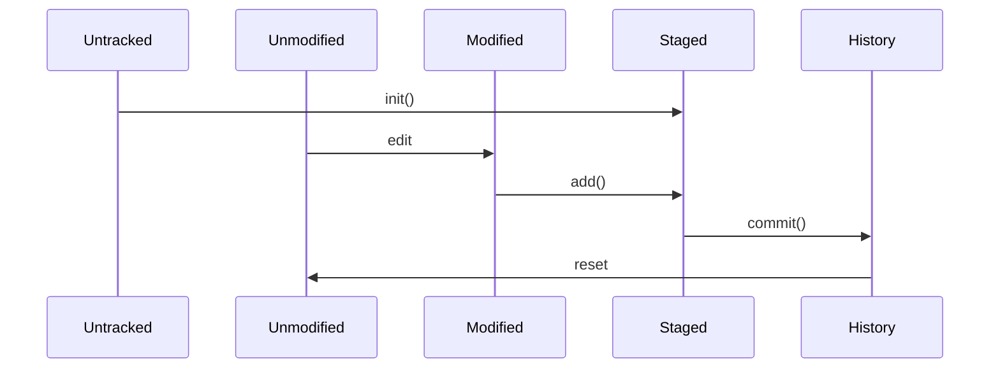

# 부스트캠프 챌린지 Day13. 소스 저장 오브젝트

> 그룹-짝번호 : 46-B  
> 캠퍼ID : J154, J225

## 페어 프로그래밍

-   vscode의 live share 기능을 사용하여 함께 코드 작성
-   slack의 hurdle 기능을 사용하여 소통  
    

-   30분 간격으로 네비게이터/드라이버 역할 변경
-   드라이버 역할이 작성한 코드를 commit 진행  
    

## 우리 체크포인트

-   [ ] 학습

    -   [x] VCS 버전관리 시스템
    -   [x] git
        -   [x] blob (Objects)
        -   [x] tree (Objects)
        -   [x] commit (Objects)
        -   [ ] delta compression
    -   [x] file
        -   [x] staged
        -   [x] tracking
        -   [x] modified
    -   [x] SHA

-   [x] 구현

    특정 디렉토리에 포함된 파일들 버전 관리를 위한 mit 명령을 만든다.

    -   [x] init : 필요한 디렉토리를 생성하고 초기화한다.

        -   오브젝트 : 디렉토리명/.mit/objects/ 또는 윈도우 디렉토리명\.mit\objects\
        -   인덱스 : 디렉토리명/.mit/index/ 또는 윈도우 디렉토리명\.mit\index\

    -   [x] add : 디렉토리에 변경된 파일들을 목록으로 만든다.

        -   [x] 디렉토리에서 전체 파일 목록을 탐색
        -   [x] 각 파일 내용에 대한 sha256 해시 값을 비교한다.
        -   [x] commit이 없거나 직전 commit 이후 해시값이 달라진 파일 목록을 저장한다.

    -   [x] status : 디렉토리에 변경된 파일 목록을 출력한다.

        -   add 명령으로 만들어진 변경된 파일 목록을 전체 경로와 함께 출력한다
        -   [x] 커밋된 변경
        -   [x] 스테이징 안된 변경

    -   [x] commit : add로 만들어진 파일들을 커밋한다.

        -   **<blob 오브젝트>** 파일별로 blob 오브젝트를 생성한다.

            -   [x] 해시값 앞에 8자리를 objects 하위 디렉토리로 생성한다.

            -   [x] 나머지 부분을 파일명으로 (위에서 만든 해시값 앞자리 디렉토리에) 저장한다.

            -   [x] blob 오브젝트 파일 내용은 원본 파일을 zlib로 압축해서 저장한다.

        -   **<tree 오브젝트>** blob 파일에 대한 기록은 tree 오브젝트에 저장한다. tree 오브젝트 파일은 objects 아래에 blob 규칙과 동일하게 생성한다.

            -   [x] tree 오브젝트는 blob마다 blob해시값, 압축후 파일크기, 파일명 순서로 한 줄씩 문자열로 기록한다.

            -   [x] ~~변경된 파일이 3개면 3줄이 생겨야 한다 .~~ 모든 파일 해시를 다 저장해야한다.

            -   [x] 작성한 tree 오브젝트 내용을 기준으로 sha256 해시값으로 blob와 동일하게 파일명을 만든다.

        -   **<commit 오브젝트>** 커밋할 때마다 이전 트리와 현재 트리를 포함하는 commit 오브젝트를 objects 아래에 생성한다.

            -   commit 오브젝트는 2가지 정보를 포함한다.

                1. 이전 tree 해시값, 현재 tree 해시값

                2. 날짜

            -   [x] 작성한 commit 오브젝트 내용을 기준으로 sha256 해시값으로 blob와 동일하게 파일명을 만든다.
            -   [x] 커밋 기록을 ~~index~~commits에 기록한다.

                -   [x] ~~.mit/index/commits~~ ./mit/commits 파일에 시간 역순으로 커밋 해시값을 한 줄씩 기록한다. 마지막 커밋이 스택 형태로 위에 추가한다.

    -   [x] log : 변경된 커밋 로그를 출력한다.

        -   [x] 디렉토리명 ~~.mit/index/commits~~ ./mit/commits 에서 커밋을 찾아서 이력을 출력한다.
        -   [x] commit 마다 현재 tree를 확인해서 변경된 파일명을 함께 표시한다.

    -   [x] restore : 이전 커밋으로 파일들을 되돌린다.

        -   [x] 특정한 커밋 해시값을 입력하면, 최신 커밋~~부터 차례대로 커밋 파일의 tree에 포함된 blob 내용을 꺼내서 파일을 복원한다.~~으로 설정한다.

        -   [x] 커밋 해시값은 앞 8자리만 입력하는 경우에도 해당 object 디렉토리에 커밋 파일이 1개만 있는 경우 그 커밋을 복원한다.

        -   [x] 단계별로 커밋은 ~~index/~~commits 파일에서 삭제하고, 입력한 커밋해시값을 가진 커밋 정보까지만 남겨놓는다.

        -   [x] 복원 과정에서 필요없는 commit, tree, blob 오브젝트는 삭제하지 않는다.
                디렉토리 아래에 .mit 하위 디렉토리를 만들고 필요한 파일을 생성한다.

## 문제 해결 과정

### 설계

#### 객체 식별

-   blob 오브젝트
-   tree 오브젝트
-   commit 오브젝트
-   index = staging area

#### mit 시퀀스 다이어그램



1.  add

    -   시퀀스다이어그램

    ```mermaid
    sequenceDiagram
        participant file
        participant blob
        participant tree
        participant staging_area
        participant index

        file->>blob: hashing()
        blob->>staging_area: staging
        blob->>tree: update-tree
        tree->>staging_area: staging
        staging_area->>staging_area: diff()
        alt if is not same
            staging_area->>index: update()
        end
    ```

    -   pseudo code

    ```js
    function init
        mkdir(.mit/objects)
        mkdir(.mit/index)

    function add
        function hash-object
            blob_file <- blob(file)

            hash <- hashing(blob_file)

            ./mit/objects/[hash] <- blob_file

            cur_staging <- hash

            return hash

        function update-tree
            tree <- [blob_hash blob_size blob_name]

            hash <- hashing(tree)

            ./mit/objects/[hash] <- tree

            cur_staging <- hash


        pre_staging <- ./mit/index/

        files
            for
                blob_hash <- hash-object(file)
                tree_hash <- update-tree(blob_hash)

            if diff(pre_staging, cur_staging) is not same

                ./mit/index <- [file_name hash mode size]
    ```

## 학습 메모

git 내부 4가지 object 이해  
https://storycompiler.tistory.com/7

git 내부 동작  
https://tecoble.techcourse.co.kr/post/2021-07-08-dot-git/  
https://git-scm.com/book/ko/v2/Git%EC%9D%98-%EB%82%B4%EB%B6%80-Git-%EA%B0%9C%EC%B2%B4

git 명령어별 원리  
https://www.youtube.com/watch?v=KyGfapLpWhY&list=PLuHgQVnccGMA8iwZwrGyNXCGy2LAAsTXk&index=15
