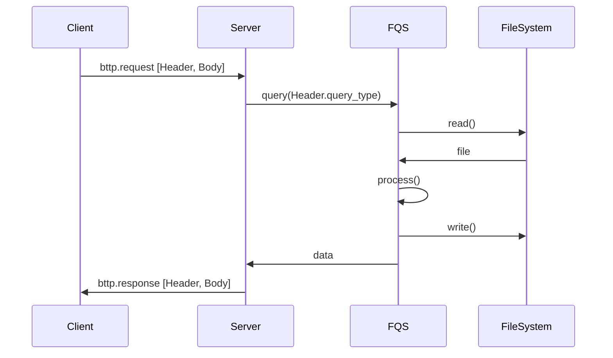

# 부스트캠프 챌린지 Day16. 파일데이터 시스템

## 나만의 체크포인트

### 기능요구사항

-   [x] CSV 파일로 저장하는 것을 우선적으로 고려한다. 외부에서 CSV 파일만 수정한 경우에도 형식에 맞으면 동작해야 한다.

-   프로그램을 시작하면 프롬프트에서 _BTTP 요청_ 을 포함하는 파일이름을 입력받는다. 반복해서 파일을 읽고 요청 내용에 맞는 동작을 실행하고 결과를 출력해야 한다.

    -   [x] cli 구현

    -   [x] run insert.success.bttp 입력할 경우 insert.success.bttp 파일을 읽고 해당 요청을 처리한다.
    -   [x] 만약 파일이 없을 경우 다시 입력받도록 처리한다.
    -   [x] 파일 확장자는 플랫폼에 맞춰서 바꿔도 되지만, 텍스트 파일 형식으로 직접 작성한다.
    -   [x] *파일에서 읽은 내용*은 >>>>>>>> 이후에 출력하고, 요청에 대한 응답은 <<<<<<<< 이후에 출력한다. (이 부분은 요청과 응답을 구분할 수 있도록 각자 변경해도 무방하다.)

-   다음과 같은 _BTTP 요청과 응답_ 을 지원하도록 구현해야 한다.

    -   [x] BTTP 요청
            모든 요청은 한 줄이 끝날 때 \n 특수문자로 줄바꿈을 명시하며 요청 문법은 다음과 같다.  
             1. 첫 줄은 요청 종류+테이블 이름+BTTP 형식  
             2. 둘째 줄부터는 요청마다 필요한 항목을 한 줄에 하나씩 포함한다.

    -   [x] BTTP 응답
            모든 응답은 한 줄이 끝날 때 \n 특수문자로 줄바꿈을 명시하며 응답 문법은 다음과 같다.  
             1. 첫 줄은 응답 코드+설명 문구  
             2. 둘째 줄부터 추가적인 데이터를 한 줄에 하나씩 포함한다.

        -   [x] 일부 명령의 경우는 JSON 데이터가 포함되어야 한다. 만약 JSON 데이터가 포함될 경우는 Content-Type 과 Content-Length를 헤더에 추가한다.

        -   [x] 데이터가 포함될 경우는 헤더와 본문을 구분하기 위해서 빈 줄을 하나 포함한다.

        -   *응답 코드*는 100, 200, 300, 400, 500 범위로 나눠진다.
            1. [x] 100 코드는 SELECT 시점에 레코드가 없는 경우 응답한다.
            2. [x] 성공한 경우는 200 코드를 응답한다.
            3. [x] 명령에 입력한 테이블 파일이 없는 경우는 300 에러를 응답한다.
            4. [x] 명령에 필요한 컬럼 개수가 일치하지 않은 경우 400 에러를 응답한다.
            5. [x] 명령에 입력한 컬럼 이름이 없을 경우는 401 에러를 응답한다.
            6. [x] 402 에러
            7. [x] 409 에러
            8. [x] 그 외 명령을 해석할 수 없다면 500 에러를 응답한다.

-   [x] 메타데이터

### 프로그래밍 요구사항

1.  CREATE 요청

    ```sql
    CREATE table_name BTTP
    Column: column1=datatype
    ```

    -   [x] 테이블을 생성할 때 테이블 이름(table_name)과 동일한 CSV 파일을 생성한다.
    -   [x] 지원하는 datatype은 숫자 Numeric, 문자열 String 만 지원한다.
    -   [x] 컬럼은 1개부터 최대 9개까지만 지원한다. 멀티라인은 지원하지 않아도 된다.
    -   [x] 내부적으로 Record 중복을 허용하지 않도록 Numeric 타입 id 컬럼을 추가한다. 다른 값은 중복 가능하다고 가정한다.
    -   [x] 컬럼 이름은 띄어쓰기를 지원하지 않고, id라는 컬럼은 추가할 수 없다.
    -   [x] 모든 컬럼은 not null로 가정한다.
    -   [x] 만약 이미 파일이 있으면 응답에 실패 메시지를 표시한다.  
             필요하다면 에러 코드를 적절하게 추가해도 무방하다.

2.  INSERT 요청

    ```sql
    INSERT table_name BTTP
    Column: column1
    Value: value1
    ```

    -   [x] 모든 컬럼은 not null로 가정하고 테이블에 컬럼 갯수와 일치하지 않으면 실패 메시지를 표시한다.
    -   [x] Column 순서와 Value 순서는 동일하다고 가정하며, 테이블 컬럼 개수와는 일치해야 한다.
    -   [x] id 값은 1부터 시작해서 INSERT 할 때마다 자동으로 +1 하나씩 증가한다.
    -   [x] value에 대해서는 숫자는 따옴표가 없고, 문자열은 따옴표가 있어야 한다.
    -   [x] 성공한 경우는 추가한 레코드 값을 응답에 표시한다.

3.  DELETE 요청

    ```sql
    DELETE table_name BTTP
    Condition: condition
    ```

    -   [x] 테이블에서 condition 조건이 맞는 레코드를 삭제한다.
    -   [x] condition 은 컬럼 중에 하나만 넣을 수 있다. (AND, OR 등 복잡한 조건은 지원하지 않아도 된다.)
    -   [x] 조건에 맞는 레코드가 없으면 실패 메시지를 표시한다.
    -   [x] 성공한 경우는 삭제한 레코드 모든 값을 출력한다.

4.  UPDATE 요청

    ```sql
    UPDATE table_name BTTP
    Column: column1
    Value: value1
    Condition: condition
    ```

    -   [x] 테이블에서 condition 조건이 맞는 레코드에 특정 컬럼 값을 변경한다. 이 때 컬럼은 1개만 지정할 수 있다.
    -   [x] condition 은 컬럼 중에 하나만 넣을 수 있다.
    -   [x] 조건에 맞는 레코드가 없으면 실패 메시지를 출력한다.
    -   [x] 성공한 경우는 변경된 레코드 모든 값을 출력한다.

5.  SELECT 요청

    ```sql
    SELECT table_name BTTP
    Condition: condition
    ```

    -   [x] 테이블에서 condition 조건이 맞는 레코드에 모든 레코드의 모든 컬럼을 출력한다.
    -   [x] condition 조건은 = , >, < 를 구현한다.
    -   [x] condition 은 컬럼 중에 하나만 넣을 수 있다.

6.  DROP 요청

    ```sql
    DROP table_name BTTP
    ```

    -   [x] 테이블 이름(table_name)과 동일한 CSV 파일도 같이 삭제한다.

## 문제 해결 과정

### 요구사항 분석

-   BTTP

    이렇게 분리 해야겠다

    1.  파일 시스템 읽기
    2.  BTTP? 로 패키징해서 요청/응답 처리
    3.  파일 DBS로 질의

-   **insert**._success_.**bttp** &larr; 파일 이름으로 추정

    1. insert &larr; sql 명령문으로 추정
    2. success &larr; 구분 이름으로 추정, 왜 success라는 이름을 쓴거야? 🤨
    3. bttp &larr; bttp? 프로토콜 말하나봄 🤨

-   _파일에서 읽은 내용_
    -   파일 시스템으로 읽고 SaaS DBS 호출하듯 사용하라는건가...?

### 설계

#### 파일시스템 데이터베이스 용어 정리

| 파일 시스템 | 데이터베이스 모델링 | 관계형 데이터베이스 |
| ----------- | ------------------- | ------------------- |
| File        | Entity              | Table               |
| Record      | Tuple               | Row                 |
| Key         | Id                  | Primary Key         |
| Field       | Attribute           | Column              |

#### 시퀀스 다이어그램



#### 서버-클라이언트 구조 구분

```
day16
├─ client.ts
├─ client
│  ├─ parser
│  │  ├─ parser.condition.ts
│  │  ├─ parser.header.ts
│  │  ├─ parser.record.ts
│  │  ├─ parser.restore.ts
│  │  ├─ parser.schema.ts
│  │  └─ parser.type.ts
│  ├─ run.ts
│  └─ utils.ts
├─ network
│  ├─ bttp.Request.ts
│  ├─ bttp.Request.type.ts
│  ├─ bttp.Response.ts
│  └─ bttp.Response.type.ts
├─ server.ts
└─ server
   ├─ File.ts
   ├─ File
   │  ├─ File.read.ts
   │  ├─ File.type.ts
   │  └─ File.write.ts
   ├─ fqs
   │  ├─ fqs.create.ts
   │  ├─ fqs.delete.ts
   │  ├─ fqs.drop.ts
   │  ├─ fqs.insert.ts
   │  ├─ fqs.select.ts
   │  ├─ fqs.ts
   │  └─ fqs.update.ts
   └─ fqs.ts
```

### 결과

   


## 학습 메모

[Vorpal](https://vorpal.js.org/)  
[json2csv](https://mircozeiss.com/json2csv/)  
[Papa Parse](https://www.papaparse.com/docs#json-to-csv)
