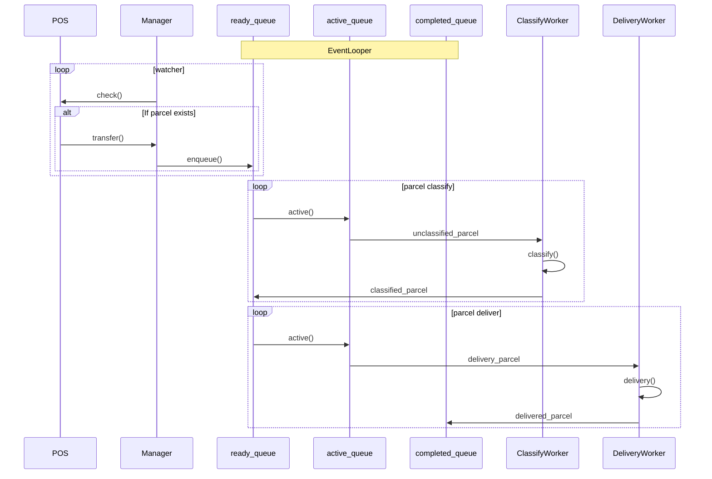

# 부스트캠프 챌린지 Day11. 택배 시뮬레이터

## 나만의 체크포인트

-   [x] 객체 식별
-   [x] 동작예시 해석 😒
-   [x] 시퀀스 다이어그램
-   [x] 슈도 코드

### 1단계. 접수 이벤트

-   [x] 직접 스레드를 만들면 안되고, Event를 처리하는 비동기 이벤트 처리하도록 구현한다.

-   [x] _접수 기계_(POS)는 접수를 **연속해서** 받을 수 있다.

    -   [x] 접수를 받으면 _접수 대기큐_(Queue)에 _추가한다_.

-   [x] 대기큐에 들어있는 이벤트를 꺼내서 처리하는 **이벤트 루퍼**(Looper)를 별도 모듈/객체로 분리해서 구현한다.

-   [x] _접수 매니저_(Manager)는 **주기적으로** 접수 대기큐에서 이벤트를 _확인한다_.

    -   [x] 접수 대기가 있을 경우, *물류 센터 큐*에 물품 이벤트를 _전달한다_.

    -   [x] 필요하면 매니저(Manager)도 배송 현황판을 표시할 이벤트를 전달할 수 있다.

-   [x] *작업자*는 물품 분류하기 시작할 때와 끝날 때 마다 이벤트를 발생한다.

    -   물류 센터별 작업자는 한 번에 1개 물품을 분류할 수 있다고 가정한다.

-   [x] *배달 기사*도 물품을 배송 시작할 때와 끝날 때 마다 이벤트를 발생한다.

    -   배달 기사는 한 번에 1개까지 물품만 배달할 수 있다고 가정한다.

    -   배달은 거리와 상관없이 동일하게 10분씩 걸린다고 가정한다.

-   [x] _택배 현황판_(DashBoard)는 전체 택배 현황을 주기적으로 화면에 출력한다.

    -   [x] 접수한 물품에 대해 대기중/분류중/배송중/배송완료 상태를 표시한다.

### 2단계. 멀티센터 배송 시뮬레이션

-   [x] 프로그램을 시작할 때 작업자와 배달 기사 인원수를 지정하도록 구현한다.

    -   [x] 프로그램이 시작하면 작업자와 배달 기사가 몇 명인지 출력한다.

-   [x] 접수를 할 때마다 접수한 고객을 구분해서 한꺼번에 접수한 물품들을 구분해서 알고 있어야 한다.

-   [x] 매니저(Manager)는 접수/배달 대기큐에서 이벤트를 받는다.

    -   [x] 접수 대기가 있을 경우 작업이 물류센터별로 물품이 적은 곳으로 이벤트를 전달한다. 물류센터별 분류 대기 목록을 관리해야 한다.

    -   [x] 물류센터 지정이 끝난 물품에 대해 배달 가능한 기사에게 작업 이벤트를 전달한다. 대기중인 배달 기사 목록을 관리해야 한다.

-   [x] 이제 물류센터는 4곳이 있다고 가정하고, 작업자는 한 번에 2개 물품까지 동시에 분류할 수 있다고 가정한다.

-   [x] 물류센터별로 작업자가 3명 이상일 경우, 각자 담당하는 물품을 분배하는 방식을 구현한다.

    -   [x] 모든 작업자가 소형,중형,대형을 모두 처리하지 않고, 작업자별로 적어도 1개는 전담하는 물품이 있어야 한다.

-   [x] 현황판에는 접수한 고객별로 접수한 물품 현황과 배달 현황을 구분해서 표시해야 한다.

    -   [x] 물품 분류가 되거나 배달이 완료되면 현황판이 바뀌어야 한다.
    -   [x] 고객이 접수한 모든 물품 배송이 완성되면 각자 자기만의 방식으로 특별하게(?) 표시해서 출력한다.

-   [x] 모든 물품이 배달되고나서 3초 동안 주문이 없으면 프로그램을 종료한다.

## 문제 해결 과정

### 객체 식별

-   EventLooper 이벤트 루퍼
-   Manager 접수 매니저 - 이벤트 관리
-   POS 접수기계 - 이벤트 등록
-   ClassifyWorker 분류 작업자
-   DeliveryWorker 배달 기사
-   DashBoard 현황판
-   LogisticsCenter 물류 센터

### 시퀀스 다이어그램



### pseudo code

```js
POS
    ready_queue <- input parcel

Manager
    machines: POSes

    function watcher
        while parcel <- POS.transfer
            min of logisticsCenter.enqueue()

LogisticsCenter
    classify_workers: subscribers
    delivery_workers: subscribers

EventLoops
    ready_queue
    active_queue
    completed_queue

    loop
        completed_queue <= active_queue <= ready_queue

```

### 결과


## 학습 메모

-   [Event Loop](https://developer.mozilla.org/ko/docs/Web/JavaScript/Event_loop)

## 개선 사항 체크포인트

-   [x] 입력 명령 처리 부분 &rarr; 받아온 입력에 대해 잘못된 입력에 대한 처리
-   [x] parcel_type이 코드의의 확장성, 재사용을 고려하여 input 메소드 밖에 선언되면 좋을 것 같아요! POS.ts
-   [x] 매직 넘버 정리
-   [x] 코드 스니핏 정리
-   [x] allocate_worker 플래그 패턴에서 플래그를 문자열 &rarr; 타입
