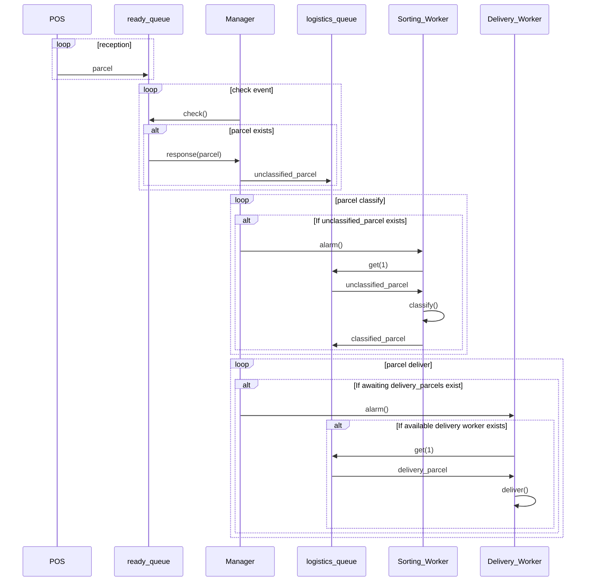

# 부스트캠프 챌린지 Day11. 접수 이벤트

## 나만의 체크포인트

-   [x] 객체 식별
-   [x] 동작예시 해석 😒
-   [x] 시퀀스 다이어그램
-   [x] 슈도 코드

### 1단계. 접수 이벤트

-   [ ] 직접 스레드를 만들면 안되고, Event를 처리하는 비동기 이벤트 처리하도록 구현한다.

-   [ ] _접수 기계_(POS)는 접수를 **연속해서** 받을 수 있다.

    -   [ ] 접수를 받으면 _접수 대기큐_(Queue)에 _추가한다_.

-   [ ] 대기큐에 들어있는 이벤트를 꺼내서 처리하는 **이벤트 루퍼**(Looper)를 별도 모듈/객체로 분리해서 구현한다.

-   [ ] _접수 매니저_(Manager)는 **주기적으로** 접수 대기큐에서 이벤트를 _확인한다_.

    -   [ ] 접수 대기가 있을 경우, *물류 센터 큐*에 물품 이벤트를 _전달한다_. &rarr; publish

    -   [ ] 필요하면 매니저(Manager)도 배송 현황판을 표시할 이벤트를 전달할 수 있다.

-   [ ] *작업자*는 물품 분류하기 시작할 때와 끝날 때 마다 이벤트를 발생한다.

    -   물류 센터별 작업자는 한 번에 1개 물품을 분류할 수 있다고 가정한다.

-   [ ] *배달 기사*도 물품을 배송 시작할 때와 끝날 때 마다 이벤트를 발생한다.

    -   배달 기사는 한 번에 1개까지 물품만 배달할 수 있다고 가정한다.

    -   배달은 거리와 상관없이 동일하게 10분씩 걸린다고 가정한다.

-   [ ] _택배 현황판_(DashBoard)는 전체 택배 현황을 주기적으로 화면에 출력한다.

    -   [ ] 접수한 물품에 대해 대기중/분류중/배송중/배송완료 상태를 표시한다.

## 문제 해결 과정

### 객체 식별

-   Looper 이벤트 루퍼
-   Manager 접수 매니저 - 이벤트 관리
    -   ready_queue 접수 큐
    -   logistics_queue 물류 센터 큐
    -
-   POS 접수기계 - 이벤트 등록
-   Sorting_Worker 분류 작업자
-   Delivery_Worker 배달 기사
-   DashBoard 현황판

### 시퀀스 다이어그램



### pseudo code

```js
POS
    ready_queue <- input parcel

Manager
    ready_queue
    delivery_queue
    sorting_workers: subscribers
    delivery_workers: subscribers

    function notify
        while unclassified_parcel <- ready_queue.pop
            sorting_workers
                filter free
            then alarm()

        while delivery_parcel <- delivery_queue.pop
            delivery_workers
                filter free
            then alarm()

Worker
    function alarm
        parcel <- get()
        result <- work( parcel )
        post( result )

Sorting_Worker extends Worker
Delivery_Worker extends Worker

```

## 학습 메모
